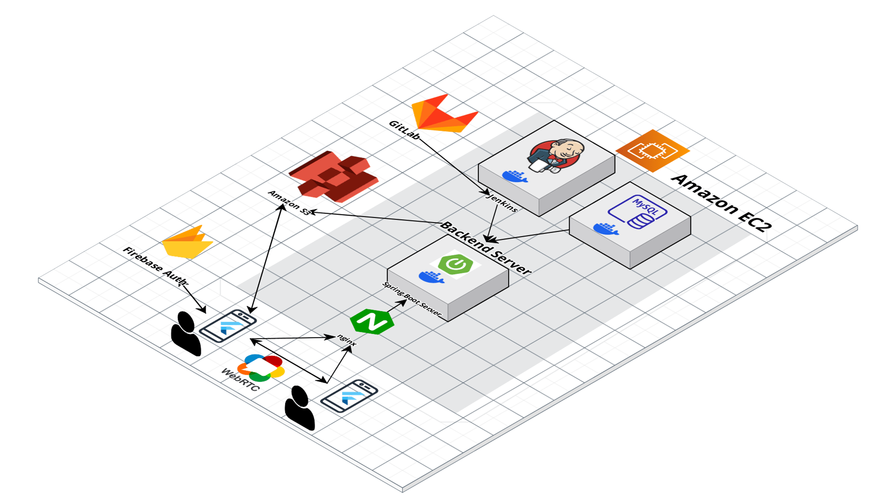
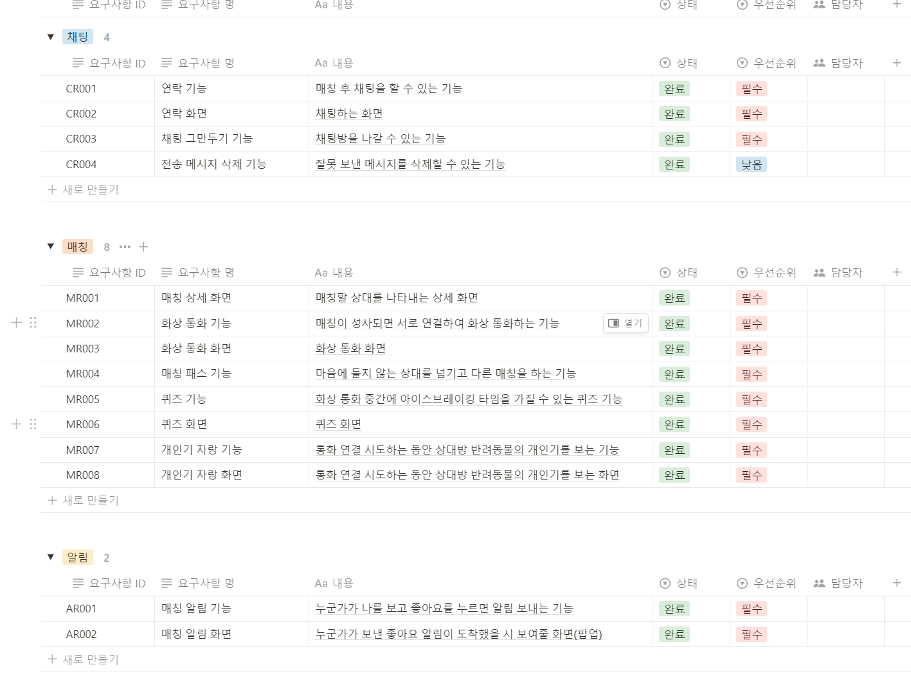
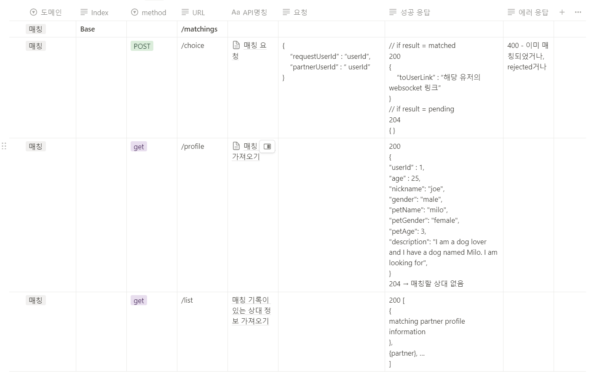

# 펫콩! 반려동물 실시간 랜덤 소개팅 모바일 어플리케이션

# 목차

### [**1. 서비스 개요**](#📌-서비스-개요)

### [**2. 기획 배경**](#☁-기획-배경)

### [**3. 서비스 기능 소개**](#🏛-서비스-기능-소개)

### [**4. 팀 구성**](#👨🏻‍💻-팀-구성)

### [**5. 기술 스택**](#🛠️-기술-스택)

### [**6. 아키텍처**](#🎨-아키텍처)

### [**7. 주요기능**](#💡-주요기능)

### [**프로젝트 산출물**](#📄-프로젝트-산출물)

# 📌 서비스 개요

- 개발 기간 : 2024.01.03 ~ 2024.02.16 (7주)
- 개요 : 반려동물 실시간 랜덤 화상 소개팅 앱

# ☁ 기획 배경

- 랜덤 매칭 화상 소개팅 서비스의 부재
- 반려동물인의 증가에 따른 새로운 사업 모델

# 🏛 서비스 기능 소개

- 랜덤 매칭 : 선호 키워드에 따른 랜덤 매칭
- 화상 채팅 : 매칭된 유저들간 WebRTC를 통한 화상채팅
- 아이스 브레이킹 : 화상 채팅 시 아이스 브레이킹할 수 있는 컨텐츠 제공

# 👨🏻‍💻팀 구성

| [박종우](https://github.com/jong29)                                                       | [강이규](https://github.com/EhighG)                                                      | [송영주](https://github.com/ztrl)                                                     | [신문영](https://github.com/ztrl)                                                   | [이정호](https://github.com/paul-lee-dev)                                                     | [주재원](https://github.com/lahmthebest)                                                 |
| ------------------------------------------------------------------------------------------ | ----------------------------------------------------------------------------------------- | ------------------------------------------------------------------------------------------ | ------------------------------------------------------------------------------------------ | ----------------------------------------------------------------------------------------- | ----------------------------------------------------------------------------------------- |
|  |  |  |  |  |  |
| 팀장, 풀스택                                                                               | 백엔드, WebRTC                                                                                    | 프론트엔드, WebRTC                                                                              | 백엔드, 인프라                                                                                | 프론트엔드                                                                                    | 프론트엔드                                                                                    |
| 매칭 알고리즘 구현                                   | 매칭 알고리즘 구현 WebRTC 시그널링 서버 구현                                            | 프로필 페이지 구현 WebRTC 상태관리                                            | CI/CD 구축  인증/인가 서비스 구현                                             | 매칭페이지 구현  Firebase 소셜로그인 구현                                               | 프로필 입력 구현  UI/UX 디자인                                                |

 

# 🛠️ 기술 스택

**Front**
 

**Back**
 

**Database**
 

**Environment**
 

**Cooperation**
 

 

# 🎨 아키텍처

 

# 💡 주요기능

- 매칭 상대 탐색

- 화상통화 with IceBreaking

# 📄 프로젝트 산출물

### [1. 요구사항 명세서]()

### [2. ERD]()

### [3. API 명세서]()

 

