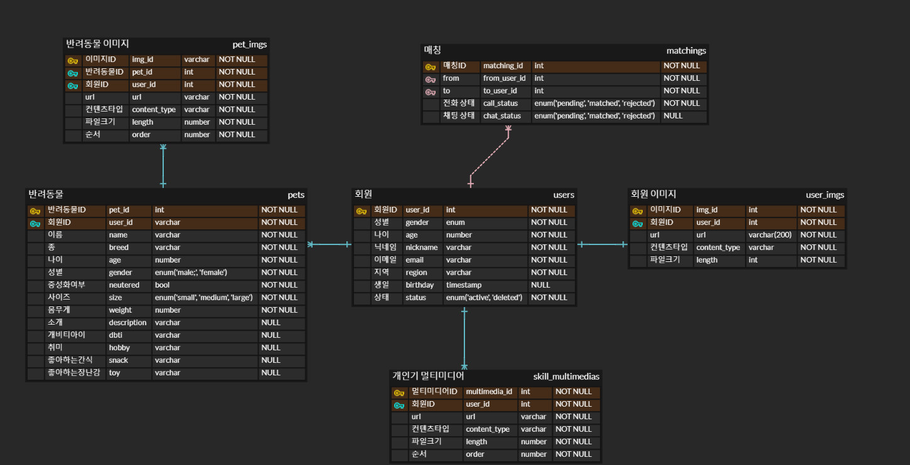

# 펫콩! 반려동물 실시간 랜덤 소개팅 모바일 어플리케이션
## 웹/모바일(웹 기술) 프로젝트

<!-- 필수 항목 -->

## 카테고리

| Application | Domain | Language | Framework |
| ---- | ---- | ---- | ---- |
| :black_square_button: Desktop Web | :black_square_button: AI | :black_square_button: JavaScript | :black_square_button: Vue.js |
| :white_check_mark: Mobile Web | :black_square_button: Big Data | :black_square_button: TypeScript | :black_square_button: React |
| :black_square_button: Responsive Web | :black_square_button: Blockchain | :white_check_mark: Dart | :white_check_mark: Flutter |
| :white_check_mark: Android App | :black_square_button: IoT | :black_square_button: C# | :black_square_button: Node.js |
| :white_check_mark: iOS App | :black_square_button: AR/VR/Metaverse | :black_square_button: Python | :black_square_button: Flask/Django |
| :black_square_button: Desktop App | :black_square_button: Game | :white_check_mark: Java | :white_check_mark: Spring/Springboot |

| Application | Domain | Language | Framework |
| ---- | ---- | ---- | ---- |
| Android App | Social Media | Java | Spring Boot |
| iOS App | Dating | Dart | Flutter |

<!-- 필수 항목 -->

## 프로젝트 소개

* 프로젝트명: 반려동물 
* 서비스 특징: 웹/모바일(웹 기술) 프로젝트를 위한 스켈레톤 프로젝트
* 주요 기능
  - 회원 관리
  - 화상 미팅룸
  - 그룹 채팅
* 주요 기술
  - WebRTC
  - WebSocket
  - JWT Authentication
  - REST API
* 참조 리소스
  * Dart
* 배포 환경
  - URL: // 웹 서비스, 랜딩 페이지, 프로젝트 소개 등의 배포 URL 기입
  - 테스트 계정: // 로그인이 필요한 경우, 사용 가능한 테스트 계정(ID/PW) 기입

<!-- 자유 양식 -->

## 팀 소개
* 박종우: 팀장, 백엔드 개발
* 이정호: 부팀장, 기획 및 와이어프레임 작성, 프론트엔드 개발
* 신문영: 백엔드 과장, 개발 및 QA 담당
* 송영주: 프론트엔드 과장, 개발, 
* 강이규: 백엔드 개발, 코드 리뷰 및 인프라 담당, CI/CD, HTTPS, Docker 구성
* 주재원: 프론트엔드 개발, Swagger API 문서 관리

<!-- 자유 양식 -->

## 프로젝트 상세 설명

// 개발 환경, 기술 스택, 시스템 구성도, ERD, 기능 상세 설명 등
### 기능명세
[기능 명세서 바로가기](https://hyper-wisteria-d2b.notion.site/c82dca87a1414de3a668275e3f75be47?pvs=74)  
{ height=440 }

### ERD
[ERD 바로가기](https://www.erdcloud.com/d/mCQ44wmdTtEFPeKst)  
{ height=440 }

### Wireframe
[와이어프레임 바로가기](https://www.figma.com/file/taokPQiKfBR0jMYqdag0NF/PetCong?type=design&node-id=0%3A1&mode=design&t=yVl8A3FTkFFbI3cB-1)  
{ height=440 }

